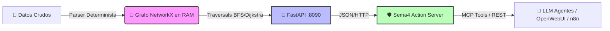

# `bnexia_graph`: Infraestructura Operativa como Grafo Determinista
> Motor que transforma datos crudos (workflows n8n, logs, topologías, APIs) en grafos dirigidos, queryables y de latencia <100ms. Expone diagnóstico causal vía FastAPI y herramientas MCP para agentes LLM.


---

## Resumen Ejecutivo
Los sistemas de documentación tradicionales (RAG vectorial sobre PDFs/Notion) son probabilísticos, costosos en tokens y ciegos a la causalidad real. `bnexia_graph` rompe ese paradigma mediante **ingeniería de grafos determinista**:
- ✅ **0 alucinaciones:** Las relaciones son extraídas estructuralmente, no inferidas por embeddings [2].
- ⚡ **<100ms/query:** El grafo reside en RAM (NetworkX). No hay I/O de base de datos en consulta [2].
- 🌍 **Exposición inmediata:** Se monta sobre Sema4.ai Action Server para crear túneles HTTPS seguros y tools MCP nativas [1].
- 🔌 **Agnóstico:** El pipeline de ingesta puede adaptarse a n8n, Mikrotik, logs de sistemas, Docker Compose, etc. [2].

---

## Arquitectura de 3 Capas


| Capa | Componente | Responsabilidad |
|------|------------|-----------------|
| **1. Ingesta** | `graphify_n8n_standalone/` | Parseo determinista. Extrae nodos, edges y metadatos. Cache SHA256 para updates incrementales [2]. |
| **2. Motor** | `graphify-out/graph.json` | Estructura persistente cargada en RAM. Soporta queries estructurales y cálculo de `blast_radius` [2]. |
| **3. Exposición** | `fast_api/` + `bnexia_actions/` | API REST para consultas directas y wrapper MCP (`@action`) para agentes IA [1], [2]. |

---

## Setup Completo (Guía Ejecutable)

### ✅ Paso 0: Clonar y preparar entorno
```bash
git clone https://github.com/TU_EMPRESA/bnexia_graph.git
cd bnexia_graph
python3 -m venv venv && source venv/bin/activate
pip install -r requirements.txt  # fastapi, uvicorn, networkx, httpx, selenium (si aplica)
```

### Paso 1: Construir el Grafo (Cualquier fuente)
El sistema está optimizado para n8n, pero es facilmente extensible.

#### A. Para n8n (Listo para usar)
```bash
# Coloca tus JSONs exportados en corpus/n8n_exports/
python -m graphify_n8n_standalone corpus/n8n_exports/
```
✅ Output: `graphify-out/graph.json` (268 nodos, 233 edges en build estándar) [2].

#### B. Para otras fuentes (Logs, Routers, APIs)
1. Crea un script `builder_custom.py` siguiendo el patrón de `_parse_n8n_workflow()` en `builder.py` [2].
2. Normaliza la salida a:
   ```json
   {"nodes": [{"id":"A","label":"Router_01","type":"network"}], 
    "edges": [{"source":"A","target":"B","confidence":1.0}]}
   ```
3. Usa `networkx.node_link_data(G)` para serializar y guardarlo como `graph.json` [2].

> **Regla de oro del parser:** Si la relación es causal o estructural, créala como `EXTRACTED` (confidence 1.0). Si es inferida por similitud, márcala como `INFERRED` (confidence <0.7) [2].

### Paso 2: Levantar la API (El Cerebro)
```bash
cd graph_api
uvicorn server:app --host 0.0.0.0 --port 8090 --reload
```
✅ Verificación: `curl http://localhost:8090/admin/reload` → recarga el grafo en caliente sin downtime [2].

### Paso 3: Exponer a Agentes (Action Server + MCP)
```bash
cd ../bnexia_actions
action-server start --auto-reload --expose --dir .
```
✅ Output esperado:
```
⚡ Local Action Server: http://localhost:8080
🌍 Public URL: https://xxxxx.sema4ai.link
🔑 Bearer key: <TOKEN>
⚡ MCP endpoint: https://xxxxx.sema4ai.link/api/mcp/
```
Cada función decorada con `@action` se convierte automáticamente en una MCP tool y un endpoint REST [1].

---

## 📖 API Reference (FastAPI :8090)
Diseñada para consumo programático. Todos los payloads son JSON.

| Endpoint | Método | Payload | Uso |
|----------|--------|---------|-----|
| `/admin/reload` | `GET` | `-` | Recarga `graph.json` tras actualizar `corpus/` [2]. |
| `/diagnostic_context` | `POST` | `{"node": "query"}` | Devuelve `upstream`, `downstream`, `blast_radius`, `category`. Incluye fallback fuzzy [2]. |
| `/blast_radius` | `POST` | `{"source": "query"}` | Impacto cascada downstream. Calcula alcance real de fallos [2]. |
| `/path` | `POST` | `{"source": "A", "target": "B"}` | Ruta causal más corta (BFS). Útil para trazas secuenciales [2]. |
| `/query` | `POST` | `{"query": "texto", "budget": 500}` | Búsqueda conceptual con límite de tokens [2]. |

---

## 🤖 Consumo por LLMs y Agentes

### 1. Vía curl (Pruebas rápidas / Scripts)
```bash
export AS_URL="https://xxxxx.sema4ai.link"
export TOKEN="<BEARER_KEY>"

curl -s -X POST "$AS_URL/api/actions/bnexia-graph-tools/get-diagnostic-context/run" \
  -H "Content-Type: application/json" \
  -H "Authorization: Bearer $TOKEN" \
  -d '{"node": "MCP B-CONNECT"}' | python3 -m json.tool
```

### 2. Vía LangChain / MultiServerMCPClient (Recomendado)
```python
from langchain_mcp_adapters.client import MultiServerMCPClient

async with MultiServerMCPClient({
    "bnexia_graph": {
        "url": f"{AS_URL}/api/mcp/",
        "transport": "streamable_http",
    }
}) as client:
    tools = client.get_tools()
    # tools ahora incluye: get_diagnostic_context, calculate_blast_radius, find_causal_path
```
> **Best Practice para LLMs:** Las acciones deben devolver `str` (JSON serializado). Los modelos parsean strings con mayor fiabilidad que objetos nativos [1].

---

## Producción, Debugging y Mejores Prácticas

| Escenario | Solución |
|-----------|----------|
| **Acción no encontrada (404)** | Verifica `action-server schema`. El nombre en URL usa kebab-case (`my_action` → `my-action`) [1]. |
| **Entorno Conda no se reconstruye** | Elimina caché: `rm -rf ~/.sema4ai/action-server/envs/<hash>/` y relanza con `--auto-reload` [1]. |
| **`get_app()` devuelve None** | Llama `get_app()` a nivel de módulo, no dentro de `@action` [1]. |
| **Concurrencia >500 QPS** | NetworkX en RAM aguanta ~100 QPS. Para más, implementa caché Redis o migra a Neo4j [2]. |
| **Exposición en Producción** | No uses `--expose`. Levanta en puerto fijo y pon Nginx/Caddy delante con TLS + `X-API-Key` [1], [2]. |
| **Timeouts en acciones largas** | DevuelveACK inmediato y patrea polling, o aumenta timeout del cliente HTTP [1]. |

---

## Guía para LLMs: Cómo usar este repo como "Skill"
Si un agente lee este README, debe seguir este flujo de decisión:

1. **Detectar objetivo:** ¿Diagnóstico de infraestructura? → Usa `/diagnostic_context`. ¿Evaluar riesgo de cambio? → Usa `/blast_radius`. ¿Trazar fallo? → Usa `/path`.
2. **Verificar estado:** Si la API está en `http://localhost:8090`, asume que el grafo está cargado. Si hay túnel `*.sema4ai.link`, usa MCP tools vía `MultiServerMCPClient` [1].
3. **Manejar incertidumbre:** Si un nodo devuelve `{"error": "Node not found"}`, aplica fuzzy search o pide al usuario el nombre exacto del workflow.
4. **Salida estructurada:** Nunca devuelvas texto ambiguo. Retorna JSON con `target_node`, `category`, `upstream`, `downstream`, `confidence` [2].
5. **Seguridad:** Nunca expongas `:8090` directamente a internet. Usa proxy reverso o túnel temporal para dev/testing [1], [2].

---

### Licencia & Mantenimiento
- **Repo:** Monorepo funcional. `graphify_n8n_standalone` puede ejecutarse standalone (`python -m ...`) o integrarse en pipelines CI/CD [2].
- **Actualización:** Usa `--update` para modo incremental. El builder compara SHA256 de archivos y solo re-procesa cambios [2].
- **Contribuciones:** Los parsers agnósticos deben seguir el esquema `nodes[] + edges[]` para mantener compatibilidad con `graph.json` [2].

*Desarrollado por Bnexia Core Team. Diseñado para observabilidad, diagnóstico causal y automatización segura de infraestructura moderna.*

